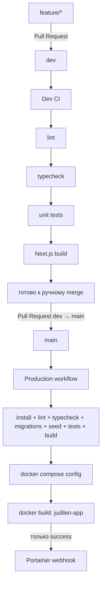

# CI/CD

## Workflows

1. `.github/workflows/dev.yml` — проверки pull request в `dev` и каждого push в `dev`; деплоя нет.
2. `.github/workflows/production.yml` — production-проверки и Portainer deploy только для push в `main`.

Старый объединенный `.github/workflows/ci.yml` удален.

## Поток изменений

Ни один workflow не выполняет merge или `git push`. Переходы `feature/* → dev` и `dev → main` выполняются только через review/merge Pull Request.

## Почему прежняя схема не работала

- Один workflow одновременно отвечал за CI и deploy.
- Он слушал `dev` и несуществующую в целевой схеме ветку `production`, но не слушал `main`.
- Deploy job был привязан к push в `dev`, поэтому тестовая ветка фактически считалась production-веткой.
- Не было независимого production gate с Docker/Compose-проверками.
- `pnpm 11.7.0` запускался с Node 20, хотя ему требуется Node не ниже 22.13; отсюда ошибка `node:sqlite`.
- Жизненный цикл веток не был выражен triggers и branch protection: автоматического merge не существовало, а production workflow после merge в `main` не запускался.

## GitHub settings checklist

Settings → Actions → General:

- Actions permissions: разрешить используемые GitHub/verified actions.
- Workflow permissions: **Read and write permissions**.
- `Allow GitHub Actions to create and approve pull requests` не требуется: workflows не создают и не объединяют PR.

Settings → Secrets and variables → Actions:

- создать secret `PORTAINER_WEBHOOK_URL`;
- значение secret не должно находиться в `.env`, Compose или workflow YAML;
- при использовании environment secret создать environment `production`.

Settings → Branches / Rulesets:

- `dev`: require pull request и check `Lint, typecheck, tests and build`;
- `main`: require pull request из `dev`; при необходимости требовать check `Lint, typecheck, tests and build`, уже выполненный для SHA ветки `dev`;
- `Test, build and deploy` запускается после push в `main`, поэтому он защищает deploy, но не может быть pre-merge check;
- запретить force push и deletion;
- не настраивать автоматический merge `main → dev`;
- GITHUB_TOKEN не требует bypass: workflows не выполняют push.

## Deploy

После любого push в `main`:

1. Production workflow устанавливает зависимости через pnpm cache.
2. Выполняет lint и typecheck.
3. Применяет миграции к изолированной PostgreSQL 16 и запускает seed.
4. Выполняет unit tests и Next.js production build.
5. Проверяет `docker-compose.yml` командой `docker compose config`.
6. Валидирует Dockerfile сборкой image `judilen-app`.
7. Последним шагом вызывает repository secret `PORTAINER_WEBHOOK_URL`.

Если любой предыдущий шаг завершается с ошибкой, webhook не вызывается.
